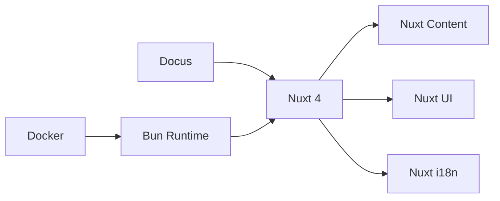

<p align="center">
  
  
  
  
  
</p>

<h1 align="center">
  <br />
  📞 stCall Docs
  <br />
</h1>

<p align="center">
  <strong>Documentação completa do stCall — Software de Call Center com WebRTC e Asterisk</strong>
</p>

<p align="center">
  <a href="#-sobre">Sobre</a> •
  <a href="#%EF%B8%8F-início-rápido">Início Rápido</a> •
  <a href="#-estrutura">Estrutura</a> •
  <a href="#-scripts">Scripts</a> •
  <a href="#-docker">Docker</a> •
  <a href="#-english-version">English</a>
</p>

---

## 🇧🇷 Português

### 📖 Sobre

Este é o site de documentação do **stCall**, construído com [Docus](https://docus.dev) (Nuxt Content + Nuxt UI). A documentação cobre desde a instalação e guia do usuário até a arquitetura interna e referência da API.

> [!NOTE]
> A documentação está disponível em **Português (pt-BR)** e **Inglês (en)** via i18n integrado.

### 📚 O que você encontra aqui

| Seção | Conteúdo |
|---|---|
| **Guia de Início** | Introdução, instalação, configuração e primeiro acesso |
| **Guia do Usuário** | Painel, chamadas, histórico, perfil, configurações e administração |
| **Arquitetura** | Visão geral, WebRTC, WebSocket, banco de dados e autenticação |
| **Desenvolvimento** | Ambiente, estrutura, frontend, backend, Asterisk e convenções |
| **Ambiente Local** | Docker e troubleshooting |
| **Referência API** | Eventos WebSocket, comandos, stores e composables |

### ⚡️ Início Rápido

> [!IMPORTANT]
> Requer [Bun](https://bun.sh) instalado na máquina.

```bash
# Instalar dependências
bun install

# Iniciar servidor de desenvolvimento
bun run dev
```

O site estará disponível em `http://localhost:3000`.

### 🐳 Docker

```bash
# Subir com docker compose
docker compose up -d
```

### 📁 Estrutura

```
docs/
├── content/
│   ├── pt-BR/              # 🇧🇷 Conteúdo em Português
│   │   ├── 1.guia-inicio/
│   │   ├── 2.guia-usuario/
│   │   ├── 3.arquitetura/
│   │   ├── 4.desenvolvimento/
│   │   ├── 5.ambiente-local/
│   │   ├── 6.api/
│   │   └── index.md
│   └── en/                 # 🇺🇸 English content
│       └── index.md
├── public/                  # Arquivos estáticos
├── patches/                 # Patches de compatibilidade
├── app.config.ts            # Configuração do tema (orange)
├── nuxt.config.ts           # Configuração Nuxt + Docus + i18n
├── Dockerfile               # Container de desenvolvimento
└── docker-compose.yml
```

### 🛠 Scripts

| Comando | Descrição |
|---|---|
| `bun run dev` | Inicia o servidor de desenvolvimento |
| `bun run build` | Build de produção |
| `bun run preview` | Preview da build de produção |

### 🎨 Tech Stack



> [!TIP]
> Para contribuir com a documentação, basta editar os arquivos `.md` dentro de `content/pt-BR/`. O Docus renderiza Markdown com suporte a componentes Vue nativos.

---

## 🇺🇸 English Version

### 📖 About

This is the documentation site for **stCall**, built with [Docus](https://docus.dev) (Nuxt Content + Nuxt UI). It covers everything from installation and user guides to internal architecture and API reference.

> [!NOTE]
> Documentation is available in **Brazilian Portuguese (pt-BR)** and **English (en)** via built-in i18n.

### 📚 What's Inside

| Section | Content |
|---|---|
| **Getting Started** | Introduction, installation, configuration, and first access |
| **User Guide** | Dashboard, calls, history, profile, settings, and admin panel |
| **Architecture** | Overview, WebRTC, WebSocket, database, and authentication |
| **Development** | Environment, project structure, frontend, backend, Asterisk, and conventions |
| **Local Environment** | Docker setup and troubleshooting |
| **API Reference** | WebSocket events, commands, stores, and composables |

### ⚡️ Quick Start

> [!IMPORTANT]
> Requires [Bun](https://bun.sh) installed on your machine.

```bash
# Install dependencies
bun install

# Start the dev server
bun run dev
```

The site will be available at `http://localhost:3000`.

### 🐳 Docker

```bash
# Start with docker compose
docker compose up -d
```

### 🛠 Scripts

| Command | Description |
|---|---|
| `bun run dev` | Start development server |
| `bun run build` | Production build |
| `bun run preview` | Preview production build |

### 🎨 Tech Stack


> [!TIP]
> To contribute to the docs, simply edit the `.md` files inside `content/`. Docus renders Markdown with native Vue component support.

---

<p align="center">
  Parte do ecossistema <strong>stCall</strong> — Call Center Software
  <br />
  <sub>Built with 🧡 using Docus + Nuxt</sub>
</p>
